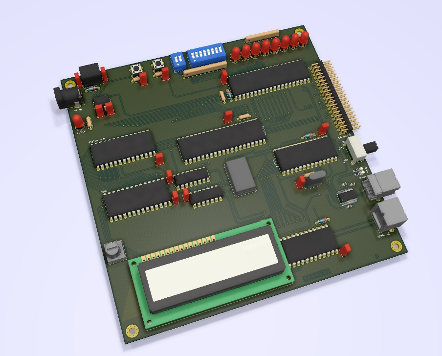

# Retro PC

## Table of Contents

- [Retro PC](#retro-pc)
  - [Table of Contents](#table-of-contents)
  - [About](#about)
  - [History](#history)
  - [Maintainer](#maintainer)

## About

A simple W650C02 microprocessor based computer development board to learn some basics of older computer systems.

Please write an e-mail to [DanielKampert@kampis-elektroecke.de](DanielKampert@kampis-elektroecke.de) if you have any questions.

## History

| **Version**  | **Description**                            | **Date**   |
|:------------:|:------------------------------------------:|:----------:|
| 1.0          | First hardware release                              | 18.10.2019 |

## Maintainer

- [Daniel Kampert](DanielKampert@kampis-elektroecke.de)
